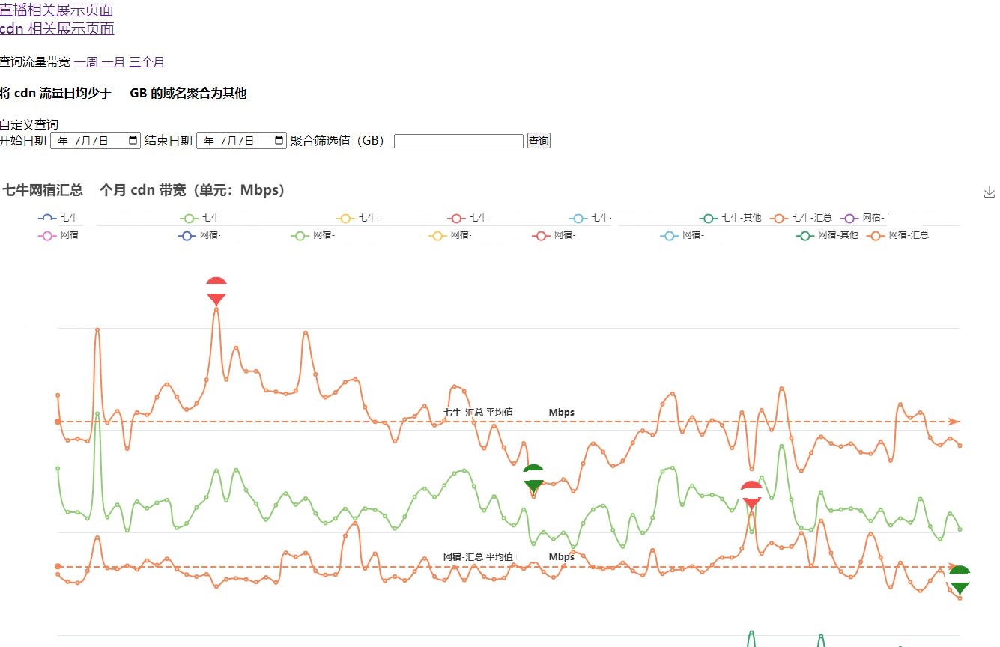
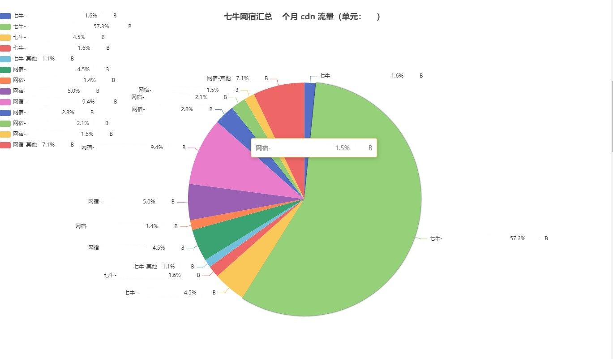

# qwflow

[](https://hub.docker.com/repository/docker/qvgz/qwflow)

使用 echarts 展示七牛网宿直播 cdn 相关带宽流量

## 说明

使用 gin template + echarts 分别汇总展网宿七牛带宽折线图，流量饼图。

只需要配置数据库、七牛网宿密钥，自动收集展示七牛网宿在用的直播、cdn 相关带宽流量数据。

每日定时从七牛网宿获取在用直播 cdn 相关带宽，流量原始数据，处理后存入数据库中，访问 web 时，从数据库获取指定范围日期数据，处理转换为带宽折线图、流量饼图。

`conf-example.json` 为配置文件示例，配置数据库、七牛网宿密钥，使用需要更名为 `conf.json`。

`flow.sql` 为 mysql 表结构，数据的存储与读取依赖固定的表结构。

运行参考

```yml
version: '3'
services:
  qwflow:
    image: qvgz/qwflow:latest
    container_name: qwflow
    restart: always
    ports:
      - "8174:8174"
    volumes:
      - ./conf.json:/app/conf.json
```

## 功能列表

- [x] 七牛自动动获取在用直播空间、cdn 域名列表，无需手动配置维护更新
- [x] 七牛直播空间 cdn 相关带宽、流量，数据获取、处理、存储、图表展示
- [ ] 七牛全站加速带宽、流量，数据获取、处理、存储、图表展示
- [x] 网宿直播域名、cdn 相关带宽、流量，数据获取、处理、存储、图表展示
- [x] 网宿属于同一业务的多个直播域名，一天同一个时刻带宽之和峰值
- [x] 每日定时从七牛网宿获取直播 cdn 相关带宽，流量原始数据，处理后存入数据库中
- [x] 七牛网宿汇总展示
- [x] 多个小流量 直播、cdn 聚合为一个 其他
- [x] 选择日期展示流量
- [x] 登陆权限验证
- [x] 容器方式运行
- [x] 流量日环比增幅超过设定值邮件告警
- [x] 折线图汇总显示最大最小
- [x] 折线图汇总显示平均线
- [x] 每周一发送图片邮件报表，外部依赖 selenium 访问 selenium/standalone-firefox 生成图片图片文件 [详情](selenium/README.md)
- [x] 饼图顺时针流量降序
- [x] 折线图自上而下带宽降序
- [x] 指定特定天获取数据

## 效果图

抹去了具体名称、数值、单位等等

带宽折线图


流量饼图

